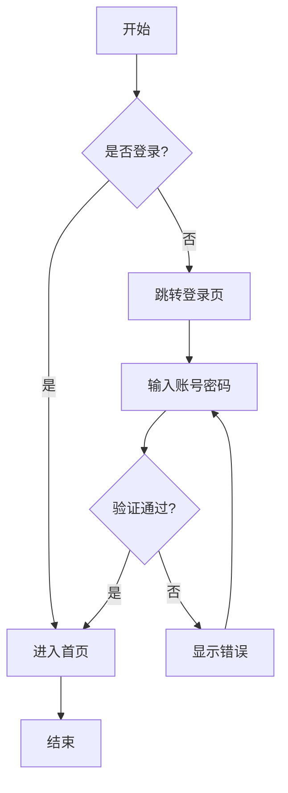
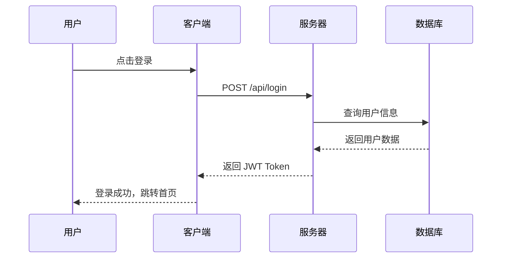
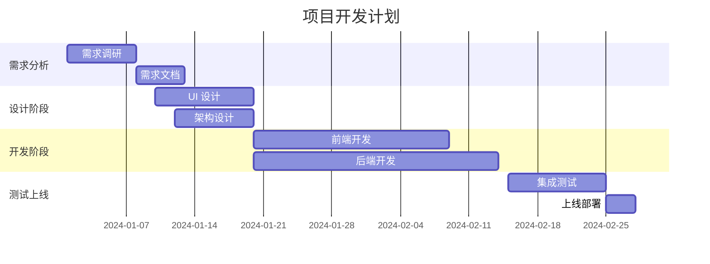
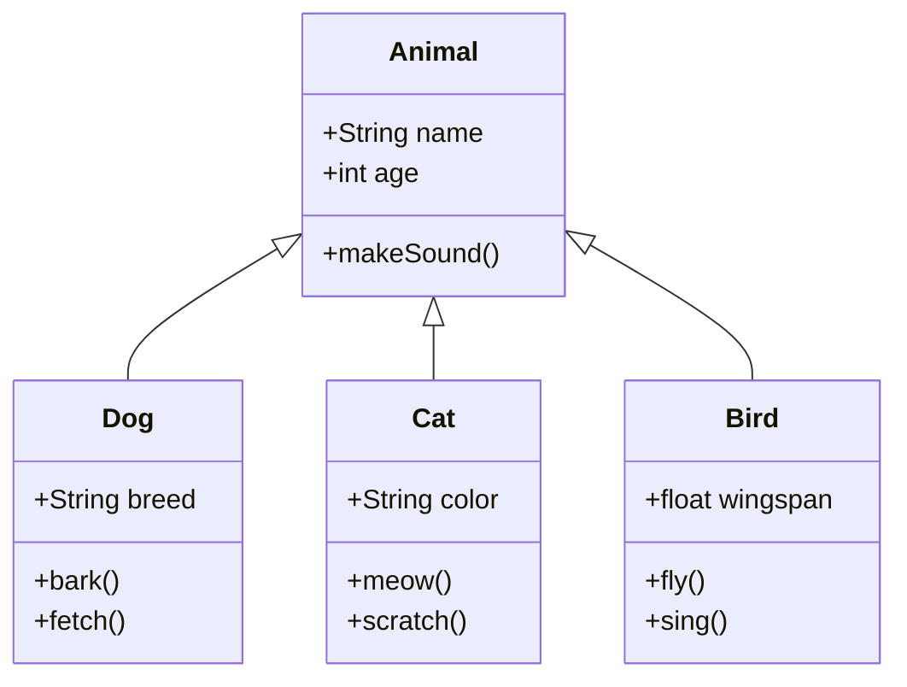
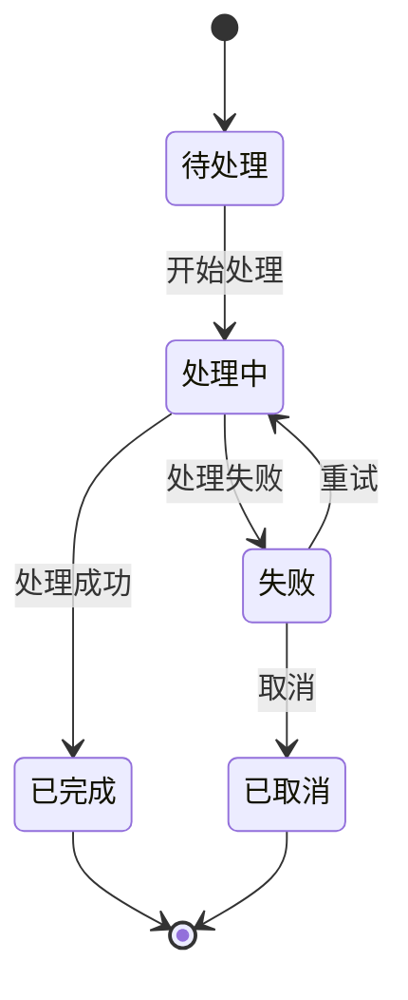
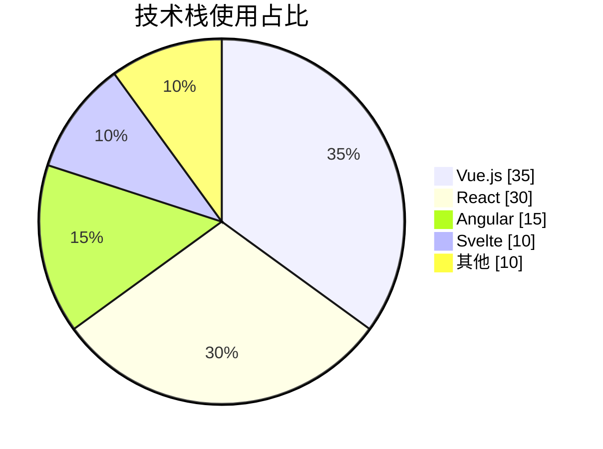
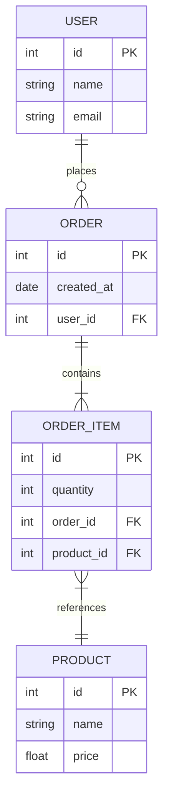

<div align="center">

# X-Markdown

一个功能强大的 Vue 3 Markdown 渲染组件库

支持流式渲染、代码高亮、LaTeX 数学公式、Mermaid 图表等特性

[](https://www.npmjs.com/package/x-markdown-vue)
[](https://www.npmjs.com/package/x-markdown-vue)
[](LICENSE)
[](https://vuejs.org/)

<div align="center">

[在线演示](https://x-markdown.netlify.app/) · [报告问题](https://github.com/element-plus-x/x-markdown/issues) · [功能请求](https://github.com/element-plus-x/x-markdown/issues/new)

</div>

</div>


## ✨ 特性

- 🚀 **Vue 3 组合式 API** - 基于 Vue 3 Composition API 构建
- 📝 **GitHub Flavored Markdown** - 完整支持 GFM 语法
- 🎨 **代码高亮** - 基于 Shiki，支持 100+ 语言和多种主题
- 🌊 **流式渲染** - 支持 AI 对话场景的实时输出动画
- 🧮 **LaTeX 数学公式** - 支持行内和块级数学公式渲染
- 📊 **Mermaid 图表** - 支持流程图、时序图等多种图表
- 🌗 **深色模式** - 内置深浅色主题切换支持
- 🔌 **高度可定制** - 支持自定义渲染、插槽和属性
- 🎭 **灵活的插件系统** - 支持 remark 和 rehype 插件扩展
- 🔒 **安全可靠** - 可选的 HTML 内容清理和消毒
- 📦 **Monorepo 架构** - 使用 pnpm workspace 和 Turbo 管理

## 📦 安装

```bash
# pnpm (推荐)
pnpm add x-markdown-vue

# npm
npm install x-markdown-vue

# yarn
yarn add x-markdown-vue
```

### 依赖项

确保安装了对等依赖:

```bash
pnpm add vue@^3.3.0
```

如果需要 LaTeX 支持，还需要引入 KaTeX 样式:

```ts
import 'katex/dist/katex.min.css'
```

## 🚀 快速开始

### 基础用法

```vue
<template>
  <MarkdownRenderer :markdown="content" />
</template>

<script setup lang="ts">
import { ref } from 'vue'
import { MarkdownRenderer } from 'x-markdown-vue'
import 'x-markdown-vue/style'

const content = ref(`
# Hello World

This is a **markdown** renderer.
`)
</script>
```

### 异步渲染

对于大型文档，可以使用异步渲染模式:

```vue
<template>
  <Suspense>
    <MarkdownRendererAsync :markdown="content" />
    <template #fallback>
      <div>加载中...</div>
    </template>
  </Suspense>
</template>

<script setup lang="ts">
import { ref } from 'vue'
import { MarkdownRendererAsync } from 'x-markdown-vue'
import 'x-markdown-vue/style'

const content = ref('# Large Document\n...')
</script>
```

## 📖 配置选项

### Props 属性

| 属性 | 类型 | 默认值 | 说明 |
|------|------|--------|------|
| `markdown` | `string` | `''` | Markdown 字符串内容 |
| `allowHtml` | `boolean` | `false` | 是否允许渲染 HTML |
| `enableLatex` | `boolean` | `true` | 是否启用 LaTeX 数学公式支持 |
| `enableAnimate` | `boolean` | `false` | 是否启用流式动画效果 |
| `enableBreaks` | `boolean` | `true` | 是否将换行符转换为 `<br>` |
| `isDark` | `boolean` | `false` | 是否为深色模式 |
| `showCodeBlockHeader` | `boolean` | `true` | 是否显示代码块头部 |
| `codeMaxHeight` | `string` | `undefined` | 代码块最大高度，如 '300px' |
| `codeBlockActions` | `CodeBlockAction[]` | `[]` | 代码块自定义操作按钮 |
| `mermaidActions` | `MermaidAction[]` | `[]` | Mermaid 图表自定义操作按钮 |
| `codeXRender` | `object` | `{}` | 自定义代码块渲染函数 |
| `customAttrs` | `CustomAttrs` | `{}` | 自定义属性对象 |
| `remarkPlugins` | `PluggableList` | `[]` | remark 插件列表 |
| `rehypePlugins` | `PluggableList` | `[]` | rehype 插件列表 |
| `sanitize` | `boolean` | `false` | 是否启用内容清洗 |
| `sanitizeOptions` | `SanitizeOptions` | `{}` | 清洗配置选项 |

## 🎨 主题配置

### 深色模式

通过 `isDark` 属性控制整体主题：

```vue
<template>
  <MarkdownRenderer :markdown="content" :is-dark="isDark" />
</template>

<script setup>
import { ref } from 'vue'

const isDark = ref(false)

const toggleTheme = () => {
  isDark.value = !isDark.value
}
</script>
```

### 代码高亮主题

支持所有 [Shiki 内置主题](https://shiki.style/themes)。

## 🔧 自定义渲染

### 自定义属性

通过 `customAttrs` 为 Markdown 元素添加自定义属性：

```vue
<MarkdownRenderer
  :markdown="content"
  :custom-attrs="{
    heading: (node, { level }) => ({
      class: ['heading', `heading-${level}`],
      id: `heading-${level}`
    }),
    a: (node) => ({
      target: '_blank',
      rel: 'noopener noreferrer'
    })
  }"
/>
```

### 自定义插槽

组件提供了强大的插槽系统，可以自定义任何 Markdown 元素的渲染：

```vue
<MarkdownRenderer :markdown="content">
  <!-- 自定义标题渲染 -->
  <template #heading="{ node, level, children }">
    <component :is="`h${level}`" class="custom-heading">
      <a :href="`#heading-${level}`" class="anchor">#</a>
      <component :is="children" />
    </component>
  </template>

  <!-- 自定义引用块渲染 -->
  <template #blockquote="{ children }">
    <blockquote class="custom-blockquote">
      <div class="quote-icon">💬</div>
      <component :is="children" />
    </blockquote>
  </template>

  <!-- 自定义链接渲染 -->
  <template #a="{ node, children }">
    <a :href="node?.properties?.href" target="_blank" class="custom-link">
      <component :is="children" />
      <span class="external-icon">↗</span>
    </a>
  </template>
</MarkdownRenderer>
```

#### 支持的插槽类型

- `heading` / `h1` ~ `h6` - 标题
- `code` / `inline-code` / `block-code` - 代码
- `blockquote` - 引用块
- `list` / `ul` / `ol` / `li` / `list-item` - 列表
- `table` / `thead` / `tbody` / `tr` / `td` / `th` - 表格
- `a` / `img` / `p` / `strong` / `em` - 行内元素
- 以及所有标准 HTML 标签名

### 自定义代码块渲染器

通过 `codeXRender` 自定义特定语言的代码块渲染：

```vue
<script setup>
import { h } from 'vue'
import EchartsRenderer from './EchartsRenderer.vue'

const codeXRender = {
  // 自定义 echarts 代码块渲染
  echarts: (props) => h(EchartsRenderer, { code: props.raw.content }),
  // 自定义行内代码渲染
  inline: (props) => h('code', { class: 'custom-inline' }, props.raw.content)
}
</script>

<template>
  <MarkdownRenderer :markdown="content" :code-x-render="codeXRender" />
</template>
```

## 🌊 流式渲染动画

启用 `enableAnimate` 属性后，代码块中的每个 token 会添加 `x-md-animated-word` class，可配合 CSS 实现流式输出动画效果：

```vue
<MarkdownRenderer :markdown="content" :enable-animate="true" />
```

```css
/* 自定义动画样式 */
.x-md-animated-word {
  animation: fadeIn 0.3s ease-in-out;
}

@keyframes fadeIn {
  from {
    opacity: 0;
  }
  to {
    opacity: 1;
  }
}
```

## 🔌 插件系统

### remark 插件

```vue
<script setup>
import remarkEmoji from 'remark-emoji'

const remarkPlugins = [remarkEmoji]
</script>

<template>
  <MarkdownRenderer :markdown="content" :remark-plugins="remarkPlugins" />
</template>
```

### rehype 插件

```vue
<script setup>
import rehypeSlug from 'rehype-slug'
import rehypeAutolinkHeadings from 'rehype-autolink-headings'

const rehypePlugins = [rehypeSlug, rehypeAutolinkHeadings]
</script>

<template>
  <MarkdownRenderer :markdown="content" :rehype-plugins="rehypePlugins" />
</template>
```

## 🛡️ 安全配置

启用内容清洗以防止 XSS 攻击：

```vue
<MarkdownRenderer
  :markdown="untrustedContent"
  :sanitize="true"
  :sanitize-options="{
    allowedTags: ['h1', 'h2', 'p', 'a', 'code', 'pre'],
    allowedAttributes: {
      a: ['href', 'target']
    }
  }"
/>
```


## 🌟 功能演示

### 代码高亮

支持 100+ 编程语言的语法高亮，基于 Shiki 引擎：

````markdown
```javascript
function greet(name) {
  console.log(`Hello, ${name}!`);
}
```

```python
def fibonacci(n):
    if n <= 1:
        return n
    return fibonacci(n-1) + fibonacci(n-2)
```
````

### LaTeX 数学公式

支持行内和块级数学公式：

```markdown
行内公式: $E = mc^2$

块级公式:
$$
\int_{-\infty}^{\infty} e^{-x^2} dx = \sqrt{\pi}
$$
```

### Mermaid 图表

X-Markdown 支持完整的 Mermaid 图表渲染，包括流程图、时序图、甘特图、类图、状态图、饼图、ER 图等多种图表类型，并提供丰富的交互功能。

## 流程图 (Flowchart)



## 时序图 (Sequence Diagram)



## 甘特图 (Gantt Chart)



## 类图 (Class Diagram)



## 状态图 (State Diagram)



## 饼图 (Pie Chart)



## ER 图 (Entity Relationship)



### 表格

支持 GFM 表格语法：

```markdown
| 特性 | 状态 |
|------|------|
| Markdown | ✅ |
| 代码高亮 | ✅ |
| LaTeX | ✅ |
| Mermaid | ✅ |
```

### 任务列表

```markdown
- [x] 支持基础 Markdown
- [x] 添加语法高亮
- [x] 实现 LaTeX 支持
- [x] 添加 Mermaid 图表
- [ ] 更多功能开发中...
```

## 💡 使用场景

- **AI 对话应用** - 支持流式渲染，适合 ChatGPT 类应用
- **技术文档站点** - 完整的 Markdown 支持，代码高亮
- **博客系统** - 丰富的格式支持和自定义能力
- **在线编辑器** - 实时预览 Markdown 内容
- **知识库系统** - 支持数学公式和图表

## 🔧 技术栈

- **[Vue 3](https://vuejs.org/)** - 渐进式 JavaScript 框架
- **[TypeScript](https://www.typescriptlang.org/)** - 类型安全的 JavaScript 超集
- **[Unified](https://unifiedjs.com/)** - Markdown/HTML 处理生态系统
  - **[remark](https://remark.js.org/)** - Markdown 解析器
  - **[rehype](https://github.com/rehypejs/rehype)** - HTML 处理器
- **[Shiki](https://shiki.style/)** - 语法高亮引擎
- **[KaTeX](https://katex.org/)** - 数学公式渲染
- **[Mermaid](https://mermaid.js.org/)** - 图表生成
- **[DOMPurify](https://github.com/cure53/DOMPurify)** - HTML 清理工具
- **[Vite](https://vitejs.dev/)** - 下一代前端构建工具
- **[Turbo](https://turbo.build/)** - 高性能构建系统

## 📁 项目结构

```
x-markdown/
├── packages/
│   ├── x-markdown/          # 核心组件库
│   │   ├── src/
│   │   │   ├── components/  # Vue 组件
│   │   │   │   ├── CodeBlock/   # 代码块组件
│   │   │   │   ├── CodeLine/    # 行内代码组件
│   │   │   │   ├── CodeX/       # 代码渲染调度器
│   │   │   │   └── Mermaid/     # Mermaid 图表组件
│   │   │   ├── core/        # 核心渲染逻辑
│   │   │   ├── hooks/       # 组合式函数
│   │   │   ├── plugins/     # 内置插件
│   │   │   └── MarkdownRender/  # 主渲染组件
│   │   └── package.json
│   └── playground/          # 演示应用
├── pnpm-workspace.yaml
├── turbo.json
└── package.json
```

## 🤝 贡献

欢迎提交 Issue 和 Pull Request！

### 开发流程

1. Fork 本仓库
2. 创建你的特性分支 (`git checkout -b feature/AmazingFeature`)
3. 提交你的改动 (`git commit -m 'Add some AmazingFeature'`)
4. 推送到分支 (`git push origin feature/AmazingFeature`)
5. 提交 Pull Request

### 开发指南

```bash
# 克隆仓库
git clone https://github.com/element-plus-x/x-markdown.git
cd x-markdown

# 安装依赖
pnpm install

# 启动开发服务器
pnpm dev

# 构建项目
pnpm build

# 格式化代码
pnpm format
```

## 📄 License

[MIT](./LICENSE) License © 2025 [element-plus-x](https://github.com/element-plus-x)

---

<div align="center">

如果这个项目对你有帮助，请给它一个 ⭐️

</div>
