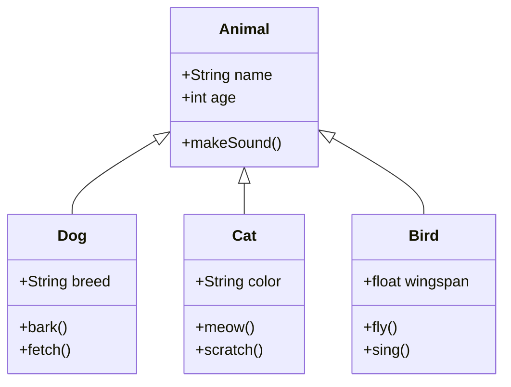
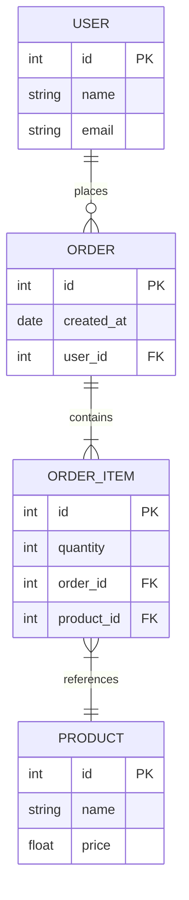

<div align="center">

# X-Markdown

一个功能强大的 Vue 3 Markdown 渲染组件库

支持流式渲染、代码高亮、LaTeX 数学公式、Mermaid 图表等特性

[](https://www.npmjs.com/package/x-markdown-vue)
[](https://www.npmjs.com/package/x-markdown-vue)
[](LICENSE)
[](https://vuejs.org/)

<div align="center">

[在线演示](https://x-markdown.netlify.app/) · [报告问题](https://github.com/element-plus-x/x-markdown/issues) · [功能请求](https://github.com/element-plus-x/x-markdown/issues/new)

</div>

</div>

## ✨ 特性

- 🚀 **Vue 3 组合式 API** - 基于 Vue 3 Composition API 构建
- 📝 **GitHub Flavored Markdown** - 完整支持 GFM 语法
- 🎨 **代码高亮** - 基于 Shiki，支持 100+ 语言和多种主题
- 🌊 **流式渲染** - 支持 AI 对话场景的实时输出动画
- 🧮 **LaTeX 数学公式** - 支持行内和块级数学公式渲染
- 📊 **Mermaid 图表** - 支持流程图、时序图等多种图表
- 🌗 **深色模式** - 内置深浅色主题切换支持
- 🔌 **高度可定制** - 支持自定义渲染、插槽和属性
- 🎭 **灵活的插件系统** - 支持 remark 和 rehype 插件扩展
- 🔒 **安全可靠** - 可选的 HTML 内容清理和消毒
- 📦 **Monorepo 架构** - 使用 pnpm workspace 和 Turbo 管理

## 📦 安装

```bash
# pnpm (推荐)
pnpm add x-markdown-vue

# npm
npm install x-markdown-vue

# yarn
yarn add x-markdown-vue
```

### 依赖项

确保安装了对等依赖:

```bash
pnpm add vue@^3.3.0
```

如果需要 LaTeX 支持，还需要引入 KaTeX 样式:

```ts
import 'katex/dist/katex.min.css'
```

## 🚀 快速开始

### 基础用法

```vue
<template>
  <MarkdownRenderer :markdown="content" />
</template>

<script setup lang="ts">
import { ref } from 'vue'
import { MarkdownRenderer } from 'x-markdown-vue'
import 'x-markdown-vue/style'

const content = ref(`
# Hello World

This is a **markdown** renderer.
`)
</script>
```

### 异步渲染

对于大型文档，可以使用异步渲染模式:

```vue
<template>
  <Suspense>
    <MarkdownRendererAsync :markdown="content" />
    <template #fallback>
      <div>加载中...</div>
    </template>
  </Suspense>
</template>

<script setup lang="ts">
import { ref } from 'vue'
import { MarkdownRendererAsync } from 'x-markdown-vue'
import 'x-markdown-vue/style'

const content = ref('# Large Document\n...')
</script>
```

## 📖 配置选项

### Props 属性

| 属性                  | 类型                | 默认值      | 说明                        |
| --------------------- | ------------------- | ----------- | --------------------------- |
| `markdown`            | `string`            | `''`        | Markdown 字符串内容         |
| `allowHtml`           | `boolean`           | `false`     | 是否允许渲染 HTML           |
| `enableLatex`         | `boolean`           | `true`      | 是否启用 LaTeX 数学公式支持 |
| `enableAnimate`       | `boolean`           | `false`     | 是否启用流式动画效果        |
| `enableBreaks`        | `boolean`           | `true`      | 是否将换行符转换为 `<br>`   |
| `isDark`              | `boolean`           | `false`     | 是否为深色模式              |
| `showCodeBlockHeader` | `boolean`           | `true`      | 是否显示代码块头部          |
| `codeMaxHeight`       | `string`            | `undefined` | 代码块最大高度，如 '300px'  |
| `codeBlockActions`    | `CodeBlockAction[]` | `[]`        | 代码块自定义操作按钮        |
| `mermaidActions`      | `MermaidAction[]`   | `[]`        | Mermaid 图表自定义操作按钮  |
| `codeXRender`         | `object`            | `{}`        | 自定义代码块渲染函数        |
| `customAttrs`         | `CustomAttrs`       | `{}`        | 自定义属性对象              |
| `remarkPlugins`       | `PluggableList`     | `[]`        | remark 插件列表             |
| `rehypePlugins`       | `PluggableList`     | `[]`        | rehype 插件列表             |
| `sanitize`            | `boolean`           | `false`     | 是否启用内容清洗            |
| `sanitizeOptions`     | `SanitizeOptions`   | `{}`        | 清洗配置选项                |

## 🎨 主题配置

### 深色模式

通过 `isDark` 属性控制整体主题：

```vue
<template>
  <MarkdownRenderer :markdown="content" :is-dark="isDark" />
</template>

<script setup>
import { ref } from 'vue'

const isDark = ref(false)

const toggleTheme = () => {
  isDark.value = !isDark.value
}
</script>
```

### 代码高亮主题

支持所有 [Shiki 内置主题](https://shiki.style/themes)。

## 🔧 自定义渲染

### 自定义属性

通过 `customAttrs` 为 Markdown 元素添加自定义属性：

```vue
<MarkdownRenderer
  :markdown="content"
  :custom-attrs="{
    heading: (node, { level }) => ({
      class: ['heading', `heading-${level}`],
      id: `heading-${level}`,
    }),
    a: (node) => ({
      target: '_blank',
      rel: 'noopener noreferrer',
    }),
  }"
/>
```

### 自定义插槽

组件提供了强大的插槽系统，可以自定义任何 Markdown 元素的渲染：

```vue
<MarkdownRenderer :markdown="content">
  <!-- 自定义标题渲染 -->
  <template #heading="{ node, level, children }">
    <component :is="`h${level}`" class="custom-heading">
      <a :href="`#heading-${level}`" class="anchor">#</a>
      <component :is="children" />
    </component>
  </template>

  <!-- 自定义引用块渲染 -->
  <template #blockquote="{ children }">
    <blockquote class="custom-blockquote">
      <div class="quote-icon">💬</div>
      <component :is="children" />
    </blockquote>
  </template>

  <!-- 自定义链接渲染 -->
  <template #a="{ node, children }">
    <a :href="node?.properties?.href" target="_blank" class="custom-link">
      <component :is="children" />
      <span class="external-icon">↗</span>
    </a>
  </template>
</MarkdownRenderer>
```

#### 支持的插槽类型

- `heading` / `h1` ~ `h6` - 标题
- `code` / `inline-code` / `block-code` - 代码
- `blockquote` - 引用块
- `list` / `ul` / `ol` / `li` / `list-item` - 列表
- `table` / `thead` / `tbody` / `tr` / `td` / `th` - 表格
- `a` / `img` / `p` / `strong` / `em` - 行内元素
- 以及所有标准 HTML 标签名

### 自定义代码块渲染器

通过 `codeXRender` 自定义特定语言的代码块渲染：

```vue
<script setup>
import { h } from 'vue'
import EchartsRenderer from './EchartsRenderer.vue'

const codeXRender = {
  // 自定义 echarts 代码块渲染
  echarts: (props) => h(EchartsRenderer, { code: props.raw.content }),
  // 自定义行内代码渲染
  inline: (props) => h('code', { class: 'custom-inline' }, props.raw.content),
}
</script>

<template>
  <MarkdownRenderer :markdown="content" :code-x-render="codeXRender" />
</template>
```

## 🌊 流式渲染动画

启用 `enableAnimate` 属性后，代码块中的每个 token 会添加 `x-md-animated-word` class，可配合 CSS 实现流式输出动画效果：

```vue
<MarkdownRenderer :markdown="content" :enable-animate="true" />
```

```css
/* 自定义动画样式 */
.x-md-animated-word {
  animation: fadeIn 0.3s ease-in-out;
}

@keyframes fadeIn {
  from {
    opacity: 0;
  }
  to {
    opacity: 1;
  }
}
```

## 🔌 插件系统

### remark 插件

```vue
<script setup>
import remarkEmoji from 'remark-emoji'

const remarkPlugins = [remarkEmoji]
</script>

<template>
  <MarkdownRenderer :markdown="content" :remark-plugins="remarkPlugins" />
</template>
```

### rehype 插件

```vue
<script setup>
import rehypeSlug from 'rehype-slug'
import rehypeAutolinkHeadings from 'rehype-autolink-headings'

const rehypePlugins = [rehypeSlug, rehypeAutolinkHeadings]
</script>

<template>
  <MarkdownRenderer :markdown="content" :rehype-plugins="rehypePlugins" />
</template>
```

## 🛡️ 安全配置

启用内容清洗以防止 XSS 攻击：

```vue
<MarkdownRenderer
  :markdown="untrustedContent"
  :sanitize="true"
  :sanitize-options="{
    allowedTags: ['h1', 'h2', 'p', 'a', 'code', 'pre'],
    allowedAttributes: {
      a: ['href', 'target'],
    },
  }"
/>
```

## 🎯 代码块自定义操作

通过 `codeBlockActions` 属性，可以为代码块添加自定义操作按钮，实现代码运行、复制、格式化等功能。

### CodeBlockAction 类型定义

```typescript
interface CodeBlockAction {
  key: string;                                          // 操作的唯一标识
  icon?: Component | FunctionalComponent | string | IconRenderFn;  // 图标（组件、SVG字符串或渲染函数）
  title?: string;                                       // 悬停提示文字
  onClick?: (props: CodeBlockSlotProps) => void;       // 点击回调函数
  disabled?: boolean;                                   // 是否禁用
  class?: string;                                       // 自定义 CSS 类名
  style?: Record<string, string>;                       // 自定义样式
  show?: (props: CodeBlockSlotProps) => boolean;       // 控制按钮显示逻辑
}

interface CodeBlockSlotProps {
  language: string;           // 代码块语言
  code: string;               // 代码内容
  copy: (text: string) => void;  // 复制函数
  copied: boolean;            // 是否已复制
  collapsed: boolean;         // 是否折叠
  toggleCollapse: () => void; // 切换折叠状态
}
```

### 基础用法

```vue
<script setup lang="ts">
import { MarkdownRenderer } from 'x-markdown-vue'
import type { CodeBlockAction } from 'x-markdown-vue'

const codeBlockActions: CodeBlockAction[] = [
  {
    key: 'run',
    title: '运行代码',
    // 使用 SVG 字符串作为图标
    icon: '<svg width="16" height="16" viewBox="0 0 24 24"><path d="M8 5v14l11-7L8 5z" fill="currentColor"/></svg>',
    onClick: (props) => {
      console.log('运行代码:', props.code)
      alert(`运行 ${props.language} 代码`)
    },
    // 仅在 JavaScript/TypeScript 代码块显示
    show: (props) => ['javascript', 'typescript', 'js', 'ts'].includes(props.language),
  },
  {
    key: 'format',
    title: '格式化代码',
    icon: '✨',
    onClick: (props) => {
      // 格式化代码逻辑
      console.log('格式化代码:', props.code)
    },
  },
]
</script>

<template>
  <MarkdownRenderer :markdown="content" :code-block-actions="codeBlockActions" />
</template>
```

### 高级示例

#### 1. 使用 Vue 组件作为图标

```vue
<script setup lang="ts">
import { h } from 'vue'
import PlayIcon from './components/PlayIcon.vue'

const codeBlockActions = [
  {
    key: 'run',
    icon: PlayIcon,  // 使用 Vue 组件
    title: '运行代码',
    onClick: (props) => {
      // 执行代码
    },
  },
]
</script>
```

#### 2. 使用图标渲染函数

```vue
<script setup lang="ts">
import { h } from 'vue'

const codeBlockActions = [
  {
    key: 'custom',
    // 图标渲染函数，可以访问 props
    icon: (props) => h('span', {
      style: { color: props.copied ? 'green' : 'currentColor' }
    }, '📋'),
    title: '自定义操作',
    onClick: (props) => {
      props.copy(props.code)
    },
  },
]
</script>
```

#### 3. 条件显示和动态样式

```vue
<script setup lang="ts">
const codeBlockActions = [
  {
    key: 'save',
    icon: '💾',
    title: '保存代码',
    // 只在代码长度超过 100 时显示
    show: (props) => props.code.length > 100,
    // 动态样式
    style: {
      color: '#42b883',
      fontWeight: 'bold',
    },
    onClick: async (props) => {
      // 保存代码到服务器
      await saveCode(props.code, props.language)
    },
  },
  {
    key: 'expand',
    icon: '⬇️',
    title: '展开/折叠',
    onClick: (props) => {
      props.toggleCollapse()
    },
  },
]
</script>
```

#### 4. 集成第三方工具

```vue
<script setup lang="ts">
import { Notify } from 'quasar'

const codeBlockActions = [
  {
    key: 'copy-enhanced',
    icon: '📋',
    title: '复制代码',
    onClick: (props) => {
      props.copy(props.code)
      // 显示通知
      Notify.create({
        message: '代码已复制到剪贴板',
        color: 'positive',
        icon: 'check',
      })
    },
  },
]
</script>
```

## 📊 Mermaid 图表自定义操作

通过 `mermaidActions` 属性，可以为 Mermaid 图表添加自定义操作按钮，实现图表编辑、导出、分享等功能。

### MermaidAction 类型定义

```typescript
interface MermaidAction {
  key: string;                                          // 操作的唯一标识
  icon?: Component | FunctionalComponent | string | MermaidIconRenderFn;  // 图标
  title?: string;                                       // 悬停提示文字
  onClick?: (props: MermaidSlotProps) => void;         // 点击回调函数
  disabled?: boolean;                                   // 是否禁用
  class?: string;                                       // 自定义 CSS 类名
  style?: Record<string, string>;                       // 自定义样式
  show?: (props: MermaidSlotProps) => boolean;         // 控制按钮显示逻辑
}

interface MermaidSlotProps {
  showSourceCode: boolean;      // 是否显示源码
  svg: string;                  // SVG 内容
  rawContent: string;           // 原始 Mermaid 代码
  isLoading: boolean;           // 是否加载中
  copied: boolean;              // 是否已复制
  zoomIn: () => void;           // 放大
  zoomOut: () => void;          // 缩小
  reset: () => void;            // 重置缩放
  fullscreen: () => void;       // 全屏显示
  toggleCode: () => void;       // 切换源码显示
  copyCode: () => Promise<void>; // 复制源码
  download: () => void;         // 下载 SVG
  raw: any;                     // 原始数据对象
}
```

### 基础用法

```vue
<script setup lang="ts">
import { MarkdownRenderer } from 'x-markdown-vue'
import type { MermaidAction } from 'x-markdown-vue'

const mermaidActions: MermaidAction[] = [
  {
    key: 'edit',
    title: '编辑图表',
    icon: '<svg width="16" height="16" viewBox="0 0 24 24"><path d="M11 4H4a2 2 0 0 0-2 2v14a2 2 0 0 0 2 2h14a2 2 0 0 0 2-2v-7" stroke="currentColor" stroke-width="2"/><path d="M18.5 2.5a2.121 2.121 0 0 1 3 3L12 15l-4 1 1-4 9.5-9.5z" stroke="currentColor" stroke-width="2"/></svg>',
    onClick: (props) => {
      // 打开编辑器，传入原始内容
      openMermaidEditor(props.rawContent)
    },
    // 仅在非源码模式下显示
    show: (props) => !props.showSourceCode,
  },
  {
    key: 'share',
    title: '分享图表',
    icon: '🔗',
    onClick: async (props) => {
      // 生成分享链接
      const shareUrl = await generateShareUrl(props.rawContent)
      navigator.clipboard.writeText(shareUrl)
      alert('分享链接已复制')
    },
  },
]
</script>

<template>
  <MarkdownRenderer :markdown="content" :mermaid-actions="mermaidActions" />
</template>
```

### 高级示例

#### 1. 使用内置方法

```vue
<script setup lang="ts">
const mermaidActions = [
  {
    key: 'zoom-in',
    icon: '🔍+',
    title: '放大',
    onClick: (props) => props.zoomIn(),
  },
  {
    key: 'zoom-out',
    icon: '🔍-',
    title: '缩小',
    onClick: (props) => props.zoomOut(),
  },
  {
    key: 'reset',
    icon: '↺',
    title: '重置',
    onClick: (props) => props.reset(),
  },
  {
    key: 'fullscreen',
    icon: '⛶',
    title: '全屏',
    onClick: (props) => props.fullscreen(),
  },
  {
    key: 'download-svg',
    icon: '💾',
    title: '下载 SVG',
    onClick: (props) => props.download(),
  },
]
</script>
```

#### 2. 导出为 PNG

```vue
<script setup lang="ts">
const mermaidActions = [
  {
    key: 'export-png',
    icon: '🖼️',
    title: '导出为 PNG',
    onClick: async (props) => {
      // 将 SVG 转换为 PNG
      const canvas = document.createElement('canvas')
      const ctx = canvas.getContext('2d')
      const img = new Image()

      img.onload = () => {
        canvas.width = img.width
        canvas.height = img.height
        ctx?.drawImage(img, 0, 0)

        canvas.toBlob((blob) => {
          if (blob) {
            const url = URL.createObjectURL(blob)
            const a = document.createElement('a')
            a.href = url
            a.download = 'mermaid-chart.png'
            a.click()
            URL.revokeObjectURL(url)
          }
        })
      }

      img.src = 'data:image/svg+xml;base64,' + btoa(props.svg)
    },
  },
]
</script>
```

#### 3. 在线编辑器集成

```vue
<script setup lang="ts">
const mermaidActions = [
  {
    key: 'edit-online',
    icon: '✏️',
    title: '在 Mermaid Live Editor 中编辑',
    onClick: (props) => {
      // 编码 Mermaid 内容并打开在线编辑器
      const encoded = btoa(encodeURIComponent(props.rawContent))
      window.open(`https://mermaid.live/edit#base64:${encoded}`, '_blank')
    },
  },
]
</script>
```

#### 4. 条件显示和状态管理

```vue
<script setup lang="ts">
import { ref } from 'vue'

const favorites = ref<Set<string>>(new Set())

const mermaidActions = [
  {
    key: 'favorite',
    icon: (props) => favorites.value.has(props.rawContent) ? '❤️' : '🤍',
    title: '收藏',
    onClick: (props) => {
      if (favorites.value.has(props.rawContent)) {
        favorites.value.delete(props.rawContent)
      } else {
        favorites.value.add(props.rawContent)
      }
    },
  },
  {
    key: 'copy',
    icon: (props) => props.copied ? '✅' : '📋',
    title: '复制源码',
    onClick: async (props) => {
      await props.copyCode()
    },
  },
]
</script>
```

#### 5. 完整示例：图表管理工具栏

```vue
<script setup lang="ts">
import { ref } from 'vue'

const isFullscreen = ref(false)

const mermaidActions = [
  // 视图控制组
  {
    key: 'toggle-code',
    icon: (props) => props.showSourceCode ? '👁️' : '📝',
    title: '切换源码',
    onClick: (props) => props.toggleCode(),
  },
  {
    key: 'fullscreen',
    icon: isFullscreen.value ? '⛶' : '⛶',
    title: '全屏',
    onClick: (props) => {
      props.fullscreen()
      isFullscreen.value = !isFullscreen.value
    },
  },

  // 缩放控制组
  {
    key: 'zoom-in',
    icon: '🔍+',
    title: '放大',
    onClick: (props) => props.zoomIn(),
  },
  {
    key: 'zoom-out',
    icon: '🔍-',
    title: '缩小',
    onClick: (props) => props.zoomOut(),
  },
  {
    key: 'reset-zoom',
    icon: '↺',
    title: '重置缩放',
    onClick: (props) => props.reset(),
  },

  // 导出操作组
  {
    key: 'download',
    icon: '💾',
    title: '下载 SVG',
    onClick: (props) => props.download(),
    show: (props) => !props.isLoading,
  },
  {
    key: 'copy',
    icon: (props) => props.copied ? '✅' : '📋',
    title: '复制源码',
    onClick: async (props) => await props.copyCode(),
  },

  // 编辑操作
  {
    key: 'edit',
    icon: '✏️',
    title: '编辑',
    onClick: (props) => {
      console.log('编辑 Mermaid 图表:', props.rawContent)
    },
    show: (props) => !props.showSourceCode && !props.isLoading,
  },
]
</script>

<template>
  <MarkdownRenderer
    :markdown="content"
    :mermaid-actions="mermaidActions"
  />
</template>
```

### 样式自定义

可以通过 `class` 和 `style` 属性自定义按钮样式：

```vue
<script setup lang="ts">
const mermaidActions = [
  {
    key: 'custom-style',
    icon: '⭐',
    title: '自定义样式按钮',
    class: 'my-custom-btn',
    style: {
      color: '#42b883',
      backgroundColor: '#e8f5f0',
      padding: '8px 12px',
      borderRadius: '6px',
      fontWeight: 'bold',
    },
    onClick: () => {
      console.log('点击了自定义样式按钮')
    },
  },
]
</script>

<style>
.my-custom-btn:hover {
  background-color: #d1ede3 !important;
  transform: scale(1.05);
  transition: all 0.2s;
}
</style>
```

## 🌟 功能演示

### 代码高亮

支持 100+ 编程语言的语法高亮，基于 Shiki 引擎：

````markdown
```javascript
function greet(name) {
  console.log(`Hello, ${name}!`)
}
```

```python
def fibonacci(n):
    if n <= 1:
        return n
    return fibonacci(n-1) + fibonacci(n-2)
```
````

### LaTeX 数学公式

支持行内和块级数学公式：

```markdown
行内公式: $E = mc^2$

块级公式:

$$
\int_{-\infty}^{\infty} e^{-x^2} dx = \sqrt{\pi}
$$
```

### Mermaid 图表

X-Markdown 支持完整的 Mermaid 图表渲染，包括流程图、时序图、甘特图、类图、状态图、饼图、ER 图等多种图表类型，并提供丰富的交互功能。

## 流程图 (Flowchart)

```mermaid
graph TB
    A[开始] --> B{是否登录?}
    B -->|是| C[进入首页]
    B -->|否| D[跳转登录页]
    D --> E[输入账号密码]
    E --> F{验证通过?}
    F -->|是| C
    F -->|否| G[显示错误]
    G --> E
    C --> H[结束]
```



## 时序图 (Sequence Diagram)

```mermaid
sequenceDiagram
    participant U as 用户
    participant C as 客户端
    participant S as 服务器
    participant D as 数据库

    U->>C: 点击登录
    C->>S: POST /api/login
    S->>D: 查询用户信息
    D-->>S: 返回用户数据
    S-->>C: 返回 JWT Token
    C-->>U: 登录成功，跳转首页
```



## 甘特图 (Gantt Chart)

```mermaid
gantt
    title 项目开发计划
    dateFormat  YYYY-MM-DD
    section 需求分析
    需求调研           :a1, 2024-01-01, 7d
    需求文档           :after a1, 5d
    section 设计阶段
    UI 设计            :2024-01-10, 10d
    架构设计           :2024-01-12, 8d
    section 开发阶段
    前端开发           :2024-01-20, 20d
    后端开发           :2024-01-20, 25d
    section 测试上线
    集成测试           :2024-02-15, 10d
    上线部署           :2024-02-25, 3d
```



## 类图 (Class Diagram)



## 状态图 (State Diagram)

```mermaid
stateDiagram-v2
    [*] --> 待处理
    待处理 --> 处理中 : 开始处理
    处理中 --> 已完成 : 处理成功
    处理中 --> 失败 : 处理失败
    失败 --> 处理中 : 重试
    失败 --> 已取消 : 取消
    已完成 --> [*]
    已取消 --> [*]
```



## 饼图 (Pie Chart)

```mermaid
pie showData
    title 技术栈使用占比
    "Vue.js" : 35
    "React" : 30
    "Angular" : 15
    "Svelte" : 10
    "其他" : 10
```



## ER 图 (Entity Relationship)



### 表格

支持 GFM 表格语法：

```markdown
| 特性     | 状态 |
| -------- | ---- |
| Markdown | ✅   |
| 代码高亮 | ✅   |
| LaTeX    | ✅   |
| Mermaid  | ✅   |
```

### 任务列表

```markdown
- [x] 支持基础 Markdown
- [x] 添加语法高亮
- [x] 实现 LaTeX 支持
- [x] 添加 Mermaid 图表
- [ ] 更多功能开发中...
```

## 💡 使用场景

- **AI 对话应用** - 支持流式渲染，适合 ChatGPT 类应用
- **技术文档站点** - 完整的 Markdown 支持，代码高亮
- **博客系统** - 丰富的格式支持和自定义能力
- **在线编辑器** - 实时预览 Markdown 内容
- **知识库系统** - 支持数学公式和图表

## 🔧 技术栈

- **[Vue 3](https://vuejs.org/)** - 渐进式 JavaScript 框架
- **[TypeScript](https://www.typescriptlang.org/)** - 类型安全的 JavaScript 超集
- **[Unified](https://unifiedjs.com/)** - Markdown/HTML 处理生态系统
  - **[remark](https://remark.js.org/)** - Markdown 解析器
  - **[rehype](https://github.com/rehypejs/rehype)** - HTML 处理器
- **[Shiki](https://shiki.style/)** - 语法高亮引擎
- **[KaTeX](https://katex.org/)** - 数学公式渲染
- **[Mermaid](https://mermaid.js.org/)** - 图表生成
- **[DOMPurify](https://github.com/cure53/DOMPurify)** - HTML 清理工具
- **[Vite](https://vitejs.dev/)** - 下一代前端构建工具
- **[Turbo](https://turbo.build/)** - 高性能构建系统

## 📁 项目结构

```
x-markdown/
├── packages/
│   ├── x-markdown/          # 核心组件库
│   │   ├── src/
│   │   │   ├── components/  # Vue 组件
│   │   │   │   ├── CodeBlock/   # 代码块组件
│   │   │   │   ├── CodeLine/    # 行内代码组件
│   │   │   │   ├── CodeX/       # 代码渲染调度器
│   │   │   │   └── Mermaid/     # Mermaid 图表组件
│   │   │   ├── core/        # 核心渲染逻辑
│   │   │   ├── hooks/       # 组合式函数
│   │   │   ├── plugins/     # 内置插件
│   │   │   └── MarkdownRender/  # 主渲染组件
│   │   └── package.json
│   └── playground/          # 演示应用
├── pnpm-workspace.yaml
├── turbo.json
└── package.json
```

## 🤝 贡献

欢迎提交 Issue 和 Pull Request！

### 开发流程

1. Fork 本仓库
2. 创建你的特性分支 (`git checkout -b feature/AmazingFeature`)
3. 提交你的改动 (`git commit -m 'Add some AmazingFeature'`)
4. 推送到分支 (`git push origin feature/AmazingFeature`)
5. 提交 Pull Request

### 开发指南

```bash
# 克隆仓库
git clone https://github.com/element-plus-x/x-markdown.git
cd x-markdown

# 安装依赖
pnpm install

# 启动开发服务器
pnpm dev

# 构建项目
pnpm build

# 格式化代码
pnpm format
```

## 📄 License

[MIT](./LICENSE) License © 2025 [element-plus-x](https://github.com/element-plus-x)

---

<div align="center">

如果这个项目对你有帮助，请给它一个 ⭐️

</div>
